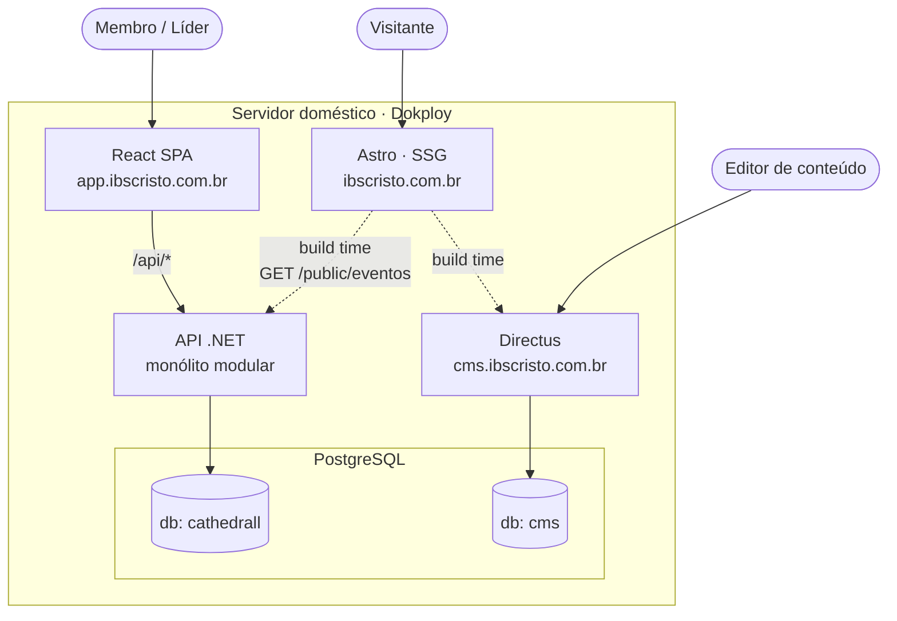
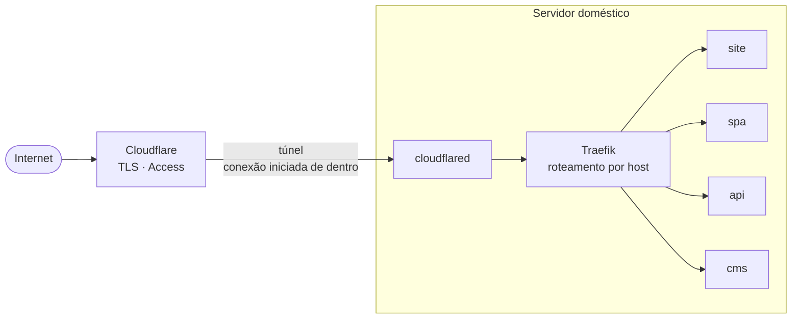

# Arquitetura

## Visão geral

Linha tracejada é acesso **em tempo de build**; linha cheia é runtime. O site publicado
não fala com ninguém.

Tudo roda na mesma máquina, orquestrado pelo Dokploy. As setas do diagrama continuam
valendo como fronteiras lógicas mesmo com todos os processos vizinhos — proximidade
física não é permissão de acesso. Note em particular que **não existe seta entre o
Directus e `db: cathedrall`**: essa ausência é a fronteira mais importante do sistema.

## Fronteiras

O ponto mais importante desta arquitetura é **o que não se comunica com o quê**.

| Fronteira | Regra |
|---|---|
| Directus ↔ CathedrAll | **Nenhuma.** Bancos separados, usuários separados. O CMS jamais enxerga dado de pessoa. |
| Site ↔ API | Somente leitura, somente `/public/*`, somente dado marcado como público. Sem autenticação de usuário final. |
| Site ↔ CMS | Somente em tempo de build. O site publicado não faz requisição ao CMS em runtime. |
| SPA ↔ API | Toda a superfície autenticada. Único consumidor de `/api/*`. |

## Hospedagem

Tudo no **Dokploy**, no servidor doméstico ([ADR-0009](adr/0009-hospedagem-unificada-dokploy.md)).

| Aplicação | Domínio |
|---|---|
| Site institucional (estático) | `ibscristo.com.br` |
| SPA CathedrAll (estático) | `app.ibscristo.com.br` |
| API .NET | `api.ibscristo.com.br` |
| Directus | `cms.ibscristo.com.br` |
| PostgreSQL | sem domínio, apenas rede interna |

Entrada por **Cloudflare Tunnel** ([ADR-0010](adr/0010-cloudflare-tunnel-como-ingress.md)):
nenhuma porta aberta no roteador. O túnel entrega tudo ao Traefik, que roteia por host.
`cms.` e o painel do Dokploy ficam atrás do Cloudflare Access.

A conexão é sempre **de dentro para fora**: o `cloudflared` se registra na Cloudflare e o
tráfego desce por esse canal. Nenhuma porta aberta no roteador.

**Consequência operacional:** uma máquina, um ponto único de falha. Queda de energia,
internet ou disco derruba **inclusive o site público**. Isso torna obrigatórios, e não
opcionais:

- retorno automático após queda de energia (BIOS + política de restart dos containers);
- monitoramento **externo** dos domínios — monitor rodando na própria máquina não avisa
  quando ela cai;
- máquina dimensionada para o pico de build, não para o repouso: builds de Node passam a
  competir por RAM com Postgres, Directus e API em produção;
- política de restart no `cloudflared` — se o conector cair, tudo fica inacessível ainda
  que os serviços estejam de pé.

**Consequência de produto:** o limite de ~100 MB por requisição do plano gratuito da
Cloudflare inviabiliza upload de vídeo no Directus. Vídeo de culto e pregação vai para o
YouTube, embedado no site; fotos e documentos seguem no Directus.

O site permanece **SSG puro**. Enquanto for assim, mover a hospedagem para fora depois é
mudar destino de deploy e DNS, sem tocar em código. Introduzir SSR ou qualquer dependência
de runtime no site fecha essa porta — e por isso exigiria um ADR próprio.

## Agenda: uma única fonte de verdade

Eventos (cultos, ensaios, eventos especiais) vivem no **CathedrAll**, porque é lá que a
escala de trabalhadores é montada. O site apenas os **exibe**, consumindo
`GET /public/eventos` em tempo de build.

Não duplique a agenda no CMS. Duas fontes de verdade para a mesma informação sempre
divergem, e quem paga é o visitante que aparece na igreja no horário errado.

O CMS cuida de conteúdo **editorial**: quem somos, ministérios, artigos, banners,
endereço, horários fixos institucionais.

## Dados pessoais e LGPD

Dado de membro de igreja é **dado pessoal sensível** (LGPD, Art. 5º, II — convicção
religiosa). O Art. 11, II, "a" dá à entidade religiosa base legal para tratar dados dos
seus fiéis sem consentimento, mas **veda o compartilhamento com terceiros** e mantém
todas as obrigações de segurança, minimização e direito de acesso/eliminação.

Requisitos que isso impõe à fundação do sistema, não ao backlog:

- Audit log de leitura e escrita sobre dados de pessoa, desde o dia 1.
- RBAC com escopo (líder vê apenas o próprio departamento).
- Soft delete e política de retenção explícita.
- Cuidado adicional com menores (ministério infantil).
- Nenhum dado de pessoa em ferramenta de terceiro sem análise prévia.

## Não decidido ainda

- Provedor de e-mail transacional (confirmação de escala).
- Estratégia de notificação por WhatsApp.
- Se o módulo financeiro será construído ou permanecerá fora do sistema.
